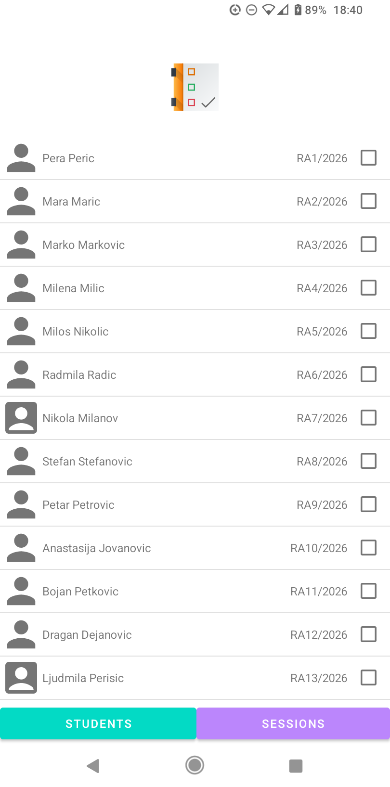
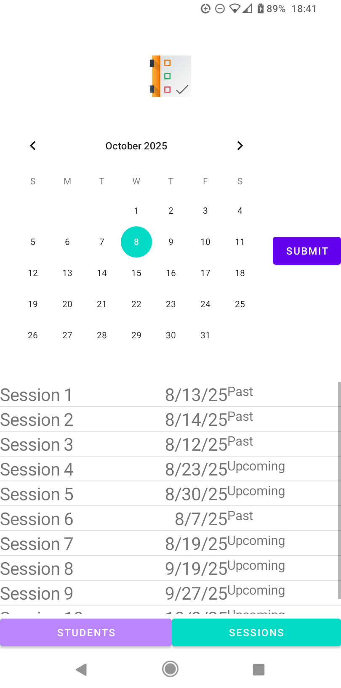
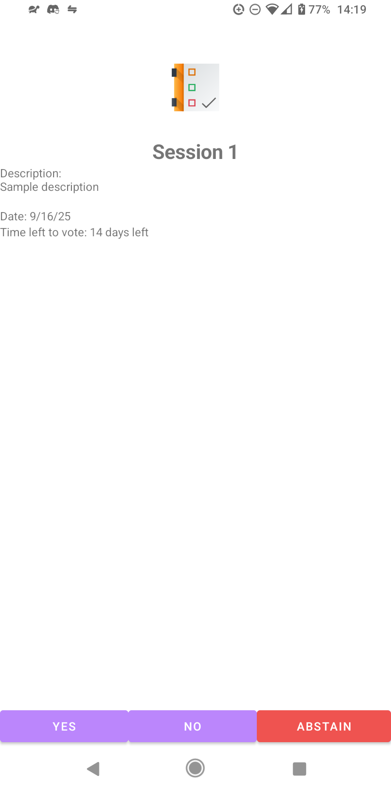
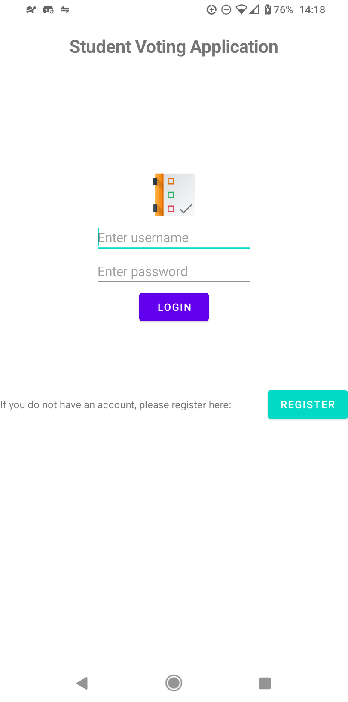

# PiARS Projekat 2025

## Autor: Bogdan Cvetanovski Pašalić, RA 26/2022

This is an Android application made for hosting voting sessions within a university environment. The application talks to a backend server with a MongoDB database, adapting it to a local SQLite database, managing user accounts (administrator, regular user), holding and managing voting sessions, and allowing regular users to cast secure, anonymous, non-repeatable votes. 









### Notes:

- Application has been tested on: 
    - Samsung Galaxy A50 (SM-A505FN), DotOS (Android 12, SDK 31, 32)
    - Huawei P30 Lite (MAR-LX1A), EMUI 10 (Android 10, SDK 29)
    - amd64 VM, AOSP (Android 16, SDK 36)
- Test screenshots can be found in `./k1_screenshots/`, `./k2_screenshots/`

### IDE information:

```
    Android Studio Meerkat | 2024.3.1 Patch 1
    Build #AI-243.24978.46.2431.13208083, built on March 13, 2025
    Runtime version: 21.0.5+-13047016-b750.29 amd64
    VM: OpenJDK 64-Bit Server VM by JetBrains s.r.o.
    Toolkit: sun.awt.X11.XToolkit
    Linux 6.12.21-1-lts
    EndeavourOS; glibc: 2.41
    GC: G1 Young Generation, G1 Concurrent GC, G1 Old Generation
    Memory: 2048M
    Cores: 16
    Registry:
        ide.experimental.ui=true
    Non-Bundled Plugins:
        IdeaVIM (2.22.0)
    Current Desktop: KDE
```
